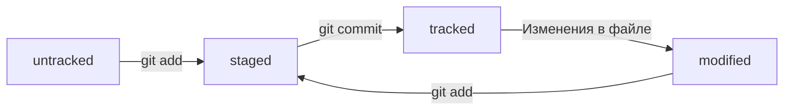

# ✨ Проект №1


Проект охраняется доброй собакой.

---

## ✨ Что такое GIT 

>**Git** — это система контроля версий, которая помогает отслеживать изменения в проекте. Этот инструмент можно использовать как для индивидуальной, так и для командной работы.

Git позволяет сохранять изменения локально и при необходимости возвращаться к предыдущим версиям проекта. Также можно создать удалённую копию на хостинг-платформе, которая работает с Git, и поделиться результатом с другими.

Основные функции системы контроля версий:

- хранит **историю изменений** в виде отдельных ревизий;
- позволяет **манипулировать историей**: например, менять порядок ревизий, полностью удалять версии, возвращаться назад в истории;
- помогает **анализировать** изменения: например, кто и когда вносит изменения, кто чаще всего вносит изменения в определённый файл и так далее.
- поддержка **параллельной работы нескольких пользователей**, в том числе над одним файлом

---

## 🛠 Команды терминала

>**Командная строка** (англ. Command-line Interface, или CLI) — тоже интерфейс, только текстовый. Пользователь вводит в неё команды. Она принимает их от пользователя и выполняет. Эта строка — обычная программа на вашем компьютере. 

```bash
pwd #вывести текущую рабочую директорию
cd ~ #перейти к домашней директории
cd #менять директории
ls #выводить содержимое директорий
ls -a #содержимое вместе со скрытыми файлами и папками
touch #создать файл
mkdir #создать директорию
mkdir -p #флаг чтобы создать целую структуру директорий
cp #копирование файлов
mv #перемещение файлов
cat <имя файла с расширением> #распечатать содержимое файла
rm
rmdir
rm -r <название директории> #удалит папку и все что она содержит
rm -rf #удалить без вопросов все содержимое и папку без подтверждений
&& #исполняет несколько команд последовательно
cd / #перейти к корневой директории
cd .. #на уровень выше
cat ~/.gitconfig #просмотреть конфигурацию гита 
 ```

 Сначала Васе Гитову нужно отредактировать todo.txt, затем выполнить git add и только в конце — git commit.

>В коммит попадает то, чтобы было предварительно добавлено «в корзину», или «в кадр», перед коммитом.

Грубо говоря, вот моя самая полезная шпаргалка:
```bash
git add <имя файла с расширением> #добавить файл для отслеживания (этот файл пойдет в коммит)
git add --all
git add . #то же самое что all

git commit -m "Сообщение" #фиксирует, добавляет файлы из add в историю изменений гита

git push #отправка изменений на удаленный репозиторий
```
## Хеш коммита

Чтобы посмотреть историю коммитов, используйте команду: `git log`

Если вы хотите видеть только первые несколько символов хеша каждого коммита и их комментарии, используйте: `git log --oneline`

## Что такое хеш и хеширование

**Хеширование** (от англ. *hash*, «рубить», «крошить», «мешанина») — это способ преобразовать набор данных и получить их «отпечаток» (англ. *fingerprint*).

Информация о коммите — это набор данных, включающий:
* время создания коммита;
* содержимое файлов в репозитории на момент коммита;
* ссылка на предыдущий, или **родительский** (англ. *parent*), коммит.

Git хеширует (преобразует) информацию о коммите с помощью алгоритма **SHA-1** (от англ. *Secure Hash Algorithm* — «безопасный алгоритм хеширования») и получает для каждого коммита свой уникальный **хеш** — результат хеширования.

Обычно хеш — это короткая (40 символов в случае SHA-1) строка, состоящая из цифр 0–9 и латинских букв A–F (неважно, заглавных или строчных). Он обладает следующими важными свойствами:

* Если хеш получить дважды для одного и того же набора входных данных, то результат будет гарантированно одинаковый.
* Если хоть что-то в исходных данных поменяется (хотя бы один символ), то хеш тоже изменится (причём сильно).

Git хранит таблицу соответствий **хеш → информация о коммите**. Если вы знаете хеш, вы можете узнать всё остальное: автора и дату коммита, а также содержимое закоммиченных файлов. Можно сказать, что хеш — основной идентификатор коммита.

Git преобразует информацию о коммитах с помощью алгоритма SHA-1 и для каждого из них рассчитывает уникальный идентификатор — хеш. Хеш — основной идентификатор коммита и позволяет узнать его автора, дату и содержимое закоммиченных файлов.

Все хеши, а также таблицу соответствий **хеш → информация о коммите**, Git хранит в папке `.git`.

Разберём элементы, из которых состоит описание коммита при использовании `git log`:

* Строка из цифр и латинских букв после слова `commit` — это **хеш коммита**.
* **Author** — имя автора и его электронная почта.
* **Date** — дата и время создания коммита.
* В конце находится **сообщение коммита**.

> Если выход из просмотра логов не произошёл автоматически, нажмите клавишу `Q` (от англ. *Quit* — «выйти») в английской раскладке клавиатуры.

---
## HEAD → Main

Среди прочих файлов в папке `.git` есть служебный файл `HEAD`. Он указывает на самый свежий коммит.

Вместо хеша последнего коммита можно написать слово **HEAD** — Git вас поймёт.

---

## Статусы Git

Одна из ключевых задач Git — отслеживать изменения файлов в репозитории. Для этого каждый файл помечается каким-либо статусом. Рассмотрим основные.

* Статусом **untracked** помечается файл, о существовании которого Git знает, но не следит за изменениями в нём. Этот статус — противоположность **tracked**, в который попадают все файлы, отслеживаемые Git.
* Файл переходит в статус **staged** после выполнения `git add`.
* Статус **modified** означает, что файл был изменён.

Большинство файлов в проектах «шагает» по следующему циклу: «изменён» → «добавлен в список на коммит» → «закоммичен» → «изменён» → и так далее.

### Подробнее про статусы

* **untracked** (англ. «неотслеживаемый»)
    Новые файлы в Git-репозитории помечаются как `untracked`, то есть неотслеживаемые. Git «видит», что такой файл существует, но не следит за изменениями в нём. У `untracked`-файла нет предыдущих версий, зафиксированных в коммитах или через команду `git add`.

* **staged** (англ. «подготовленный»)
    После выполнения команды `git add` файл попадает в **staging area** (от англ. *stage* — «сцена», «этап [процесса]» и *area* — «область»), то есть в список файлов, которые войдут в коммит. В этот момент файл находится в состоянии `staged`.
    Команда `git add` добавляет текущее содержимое файла на «сцену» для общей фотографии (коммита), а `git commit` делает снимок всей сцены целиком.

    **Staging area** также называют **index** (англ. «каталог») или **cache** (англ. «кеш»), а состояние файла `staged` иногда называют `indexed` или `cached`. Все три варианта могут встречаться в документации, в качестве флагов команд Git, а также в интернете — например, в вопросах и ответах на сайте Stack Overflow.

    Команда `git add` добавляет в `staging area` только текущее содержимое файла. Если вы, например, сделаете `git add file.txt`, а затем измените `file.txt`, то новое содержимое файла не будет находиться в `staging`. Git сообщит об этом с помощью статуса `modified`: файл изменён относительно той версии, которая уже в `staging`. Чтобы добавить в `staging` последнюю версию, нужно выполнить `git add file.txt` ещё раз.

### Типичный жизненный цикл файла в Git



1.  Файл только что создали. Git ещё не отслеживает содержимое этого файла. Состояние: **untracked**.
2.  Файл добавили в staging area с помощью `git add`. Состояние: staged (+tracked).
3.  Возможно, изменили файл ещё раз. Состояния: staged, modified (+tracked). Обратите внимание: staged и modified у одного файла, но у разных его версий.
4.  Ещё раз выполнили `git add`. Состояние: staged (+tracked).
5.  Сделали коммит с помощью `git commit`. Состояние: tracked.
6.  Изменили файл. Состояние: modified (+tracked).
7.  Снова добавили в staging area с помощью `git add`. Состояние: staged (+tracked).
8.  Сделали коммит. Состояния: tracked.
9.  Повторили пункты 4–7 много-много раз.

### Как читать `git status`

Какие состояния показывает `git status`:

Большинство файлов в типичном проекте будут находиться в состоянии `tracked` (то есть закоммичены и не изменены после коммита). Вы не увидите это состояние в выводе команды `git status` — иначе она бы каждый раз выводила список вообще всех файлов проекта.

---
## Оформление сообщений к коммитам

### Стандарт Conventional Commits

Стандарт **Conventional Commits** (англ. «соглашение о коммитах») отличается качественной документацией и подробной проработкой. Он подходит для репозиториев с исходным кодом программ. Использовать его для других типов проектов (например, для перевода книги) было бы неудобно.

Conventional Commits предлагает такой формат коммита: `<type>: <сообщение>`. Первая часть `type` — это тип изменений. Таких типов достаточно много. Вот два примера:

* **feat** (сокращение от англ. *feature*) — для новой функциональности;
* **fix** (от англ. «исправить», «устранить») — для исправленных ошибок.

Более подробный список можно увидеть на сайте с описанием этого стиля.

Например, сообщение может быть таким:

`git commit -m "feat: добавить подсчёт суммы заказов за неделю"`

### GitHub-стиль

GitHub можно использовать не только для хранения файлов проекта, но и для ведения списка **задач** (англ. *issue*) этого проекта. Если коммит «закрывает» или «решает» какую-то задачу, то в его сообщении удобно указывать ссылку на неё. Для этого в любом месте сообщения нужно указать `#<номер задачи>`. Например, вот так:

`$ git commit -m "Исправить #334, добавить график температуры"`

В таком случае GitHub свяжет коммит и задачу.

### 💡 Инфинитив и императив

Для сообщений на русском языке часто рекомендуют использовать **инфинитивы**. Например: `Добавить тесты для PipkaService`, `Исправить ошибку #123` и так далее.

Для сообщений на английском рекомендуется использовать **повелительное наклонение** (англ. *imperative*). Например: `Use library mega_lib_300`, `Fix exit button` и так далее.

Эти рекомендации сложились исторически, и им следуют многие проекты.